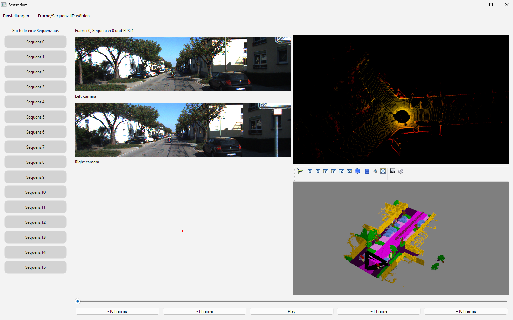

.. image:: https://github.com/danit-niwattananan-personal/sensorium_ssc/actions/workflows/github-actions.yml/badge.svg
   :target: https://github.com/danit-niwattananan-personal/sensorium_ssc/actions
   :alt: pipeline status

.. image:: https://codecov.io/gh/danit-niwattananan-personal/sensorium_ssc/graph/badge.svg?token=Z22I1ZQPKT 
   :target: https://codecov.io/gh/danit-niwattananan-personal/sensorium_ssc
   :alt: coverage report

.. image:: https://img.shields.io/badge/License-Apache_2.0-blue.svg
   :target: LICENSES/Apache-2.0.txt
   :alt: License

=========
Sensorium
=========

A sensor network visualization tool tailored for Semantic Scene Completion (SSC) datasets used in autonomous driving applications.

Features
========
- Sensor data visualization with support for cameras and LiDAR point clouds
- Odometry ground truth and semantic voxel ground truth visualization
- Interactive 3D voxel visualization
- Dataset playback and timeline controls
- Switching between different scenes and sequences in a dataset
- Communication architecture for hosting sensor data on server and run visualization on client machine

Installation
===========

Prerequisites
------------
- uv Python package manager. Follow the official `uv documentation <https://docs.astral.sh/uv/getting-started/installation/#standalone-installer>`_ for installation instructions.
- conda might disrupt the environment during creating the .venv environment with uv. Please deactivate conda before running uv.

Setup
-----

1. Clone the repository and setup the dependencies with:

.. code-block:: bash

   uv sync

2. Download the dataset to be visualized. Currently (18.03.2025), the repository only supports the semantic kitti dataset. After downloading it, organize the data in the following manner:

.. code-block:: bash

   /path/to/dataset/
               └── sequences/
                        ├── 00/
                        │   ├── poses.txt
                        │   ├── calib.txt
                        │   ├── image_2/
                        │   ├── image_3/
                        │   ├── labels/
                        │   │     ├ 000000.label
                        │   │     └ 000001.label
                        |   ├── voxels/
                        |   |     ├ 000000.bin
                        |   |     ├ 000000.label
                        |   |     ├ 000000.occluded
                        |   |     ├ 000000.invalid
                        |   |     ├ 000001.bin
                        |   |     ├ 000001.label
                        |   |     ├ 000001.occluded
                        |   |     ├ 000001.invalid
                        │   └── velodyne/
                        │         ├ 000000.bin
                        │         └ 000001.bin
                        ├── 01/
                        ├── 02/
                        .
                        .
                        .
                        └── 21/

3. Declare the path to the dataset folder in the ``configs/sensorium.yaml`` file:

.. code-block:: bash
   data_dir: /path/to/dataset

Usage
=====
Starting the Application
-----------

1. Launch the server with:

.. code-block:: bash

   uv run src/sensorium/launch/launch.py # use \ for windows paths
then select the server option and specify the port number through which data will be streamed. 

2. Launch the client with:

.. code-block:: bash

   uv run src/sensorium/launch/launch.py # use \ for windows paths
then select the client option and specify the server IP address and port number. If the server and client are running on the same machine, use ``localhost`` as the IP address.

3. After the connection is established, click ``Open Engine`` to start the visualization GUI windows. To start streaming, double-click the ``Play`` button. It should look like this.

Development
==========

Setup Development Environment
---------------------------
Clone the repository and setup your local checkout:

.. code-block:: bash

   uv sync

Testing
---------

The project uses pytest as its test runner, run the testsuite by simply invoking ``uv run pytest``. Since the project also employs CI pipeline to test and build the source code, you can check whether pipeline will pass with following commands at the project root before committing your changes:

.. code-block:: bash

   uv run python -m ruff format --diff docs src tests
   uv run python -m pytest --cov --cov-report=term
   uv run python -m mypy docs src tests
   uv run ruff check
   uv run reuse lint

Type hinting and code checking are performed with `Ruff <https://marketplace.cursorapi.com/items?itemName=charliermarsh.ruff>`_ and `Mypy <https://marketplace.cursorapi.com/items?itemName=ms-python.mypy-type-checker>`_. Installing the extensions in VSCode for automatic type-checking and formatting is recommended.

Documentation
-------------------

Documentation is written with sphinx, to build the documentation from its source run sphinx-build:

.. code-block:: bash

   uv run sphinx-build -a docs public

The entrypoint to the local documentation build should be available under ``public/index.html``.

Issues
------

If you encounter any issues, please report them to the `issue tracker <https://github.com/danit-niwattananan-personal/sensorium_ssc/issues>`_.
